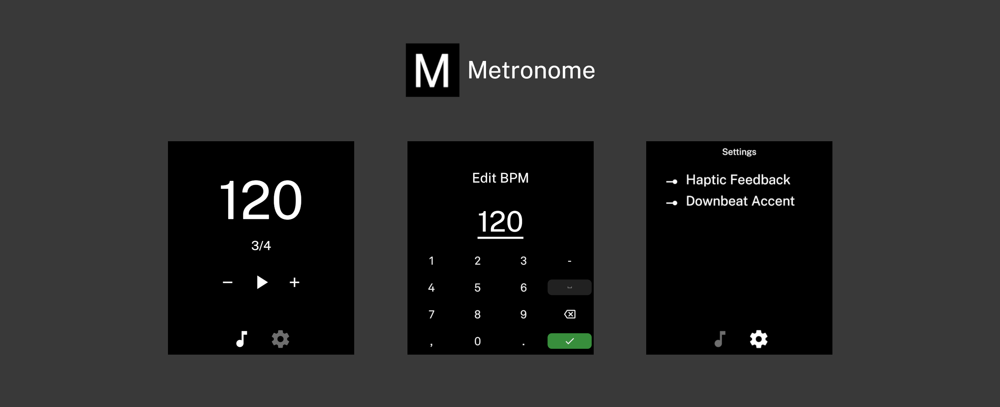

<p>A minimal metronome app for the Light Phone 3.</p>

## Setup

```bash
# Enter development shell (if you're running Nix)
nix develop
```

```bash
bun install
bunx expo run:android
```

## Commands

```bash
bun start                 # Start dev server
bun run sync-version      # Sync version from app.json
bun run generate-icon     # Regenerate app icon
bun run generate-click    # Regenerate click sounds
```

## Acknowledgements

Thanks <a href="https://github.com/vandamd">Vandam</a> for all your work!
