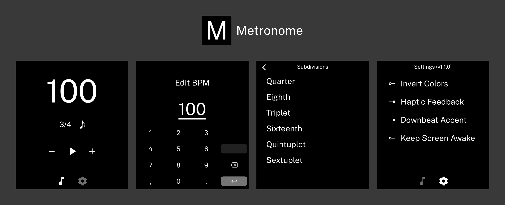

A minimal metronome app for the Light Phone 3.

## Features

- Editable BPM with incremental adjustment buttons
- Optional downbeat emphasis
- Note subdivisions
- Haptic feedback on beat

## Installation

The latest APK is available in [releases](https://github.com/garado/metronome/releases/).

I recommend using [Obtainium](https://github.com/ImranR98/Obtainium) and adding the repository's URL to receive updates.

## Acknowledgements

Thanks [Vandam](https://github.com/vandamd) for all your work!
